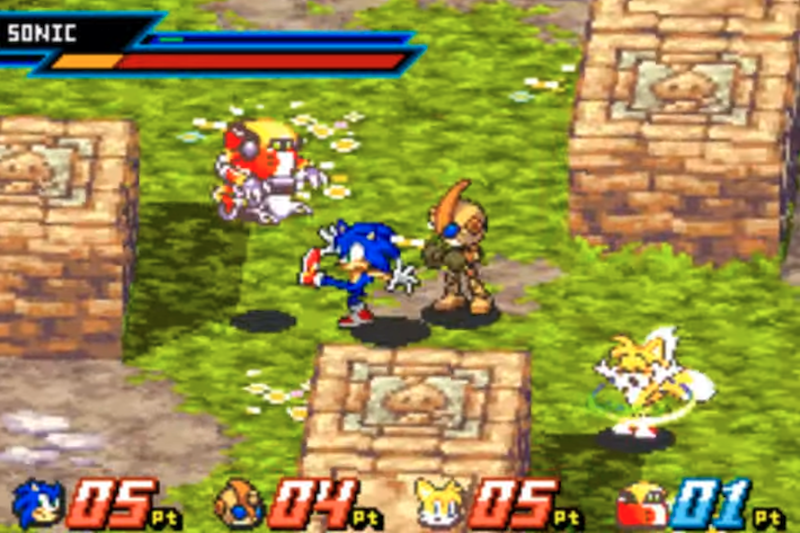
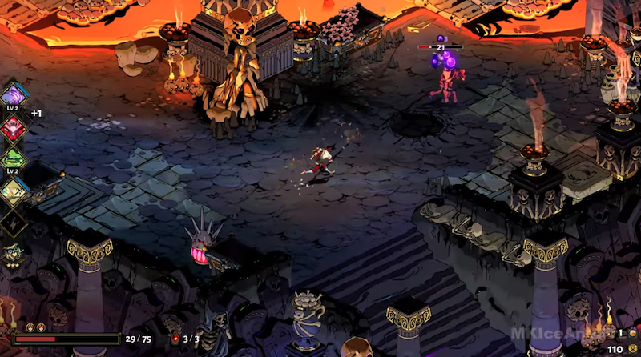
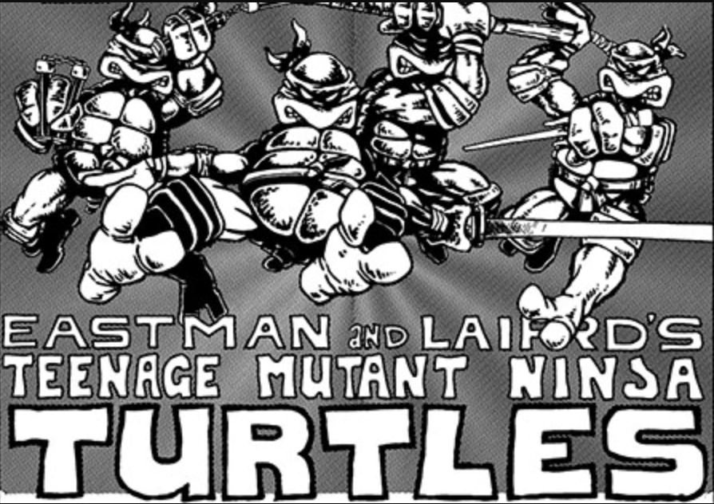
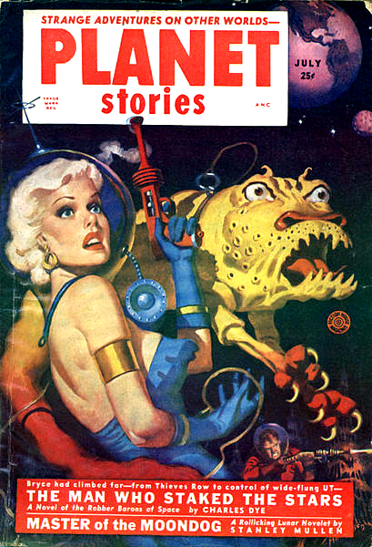

# Distrito Sarlanga
## Documento de Concepto

**Versión 1.0.0**  
**24/07/2024**  
**Julián Ezequiel Ábrego**  

---

## 1. Visión General

### 1.1. Un Renglón
**Arena Fighter** de estética callejera protagonizada por una lombriz de tierra que debe luchar contra pandillas de diferentes insectos por el control territorial del inframundo urbano.

### 1.2. Un Párrafo
**Distrito Sarlanga** es un juego de **peleas en arena (Arena Fighter)** ágil y dinámico. Las batallas se llevan adelante en escenarios con vista pseudo-isométrica 2.5D. El jugador toma el control de una lombriz de tierra decidida a conquistar el inframundo urbano de Distrito Sarlanga a fuerza de cabezazos, llaves de agarre y el uso de todo tipo de elementos que encuentre en el escenario como arma. Su motivación surge por el hartazgo tras años de sometimiento de su especie a vivir hacinados en espacios de tierra gastada y contaminada por parte de otros insectos mafiosos y violentos que sacan ventaja de sus patas y alas para apoderarse de los territorios más codiciados. El tono del protagonista combina elementos del cine de gángsters y física brutal de juegos como Def Jam, con humor absurdo de escenarios urbanos visto desde escalas diminutas.

### 1.3. Características Principales

#### 1.3.1. Combate físico e interactivo
Enfocado en agarres, estampados contra estructuras del mapa y uso de objetos cotidianos a escala gigante desde el punto de vista de los insectos (colillas de cigarrillos, fósforos, clips).

#### 1.3.2. Humor absurdo y actitud callejera
Dramatismo de guerra de pandillas y mafia aplicado a conflictos de insectos (peleas por tierra fértil, comida tirada, bolsas de basura).

#### 1.3.3. Escala diminuta y perspectiva pseudo-isométrica
Cámara de 2.5D pseudo-isométrica mostrando escenarios urbanos y grotescos en 3D sobre el que se desplazan sprites 2D, similar a la estética de Sonic Battle (Game Boy Advance, 2003). Los ambientes humanos cotidianos se transforman en arenas de batalla gigantescos.

### 1.4. Background
**Distrito Sarlanga** se inspira en la agilidad y agresividad de juegos de peleas grupales con interacción de elementos del escenario tales como **Power Stone** (Sega Dreamcast, 1999) y **Sonic Battle** (Game Boy Advance, 2003), y adopta una estética oscura y urbana como la de **Def Jam, Fight for NY** (Playstation 2, XBOX, Gamecube, 2004)., adaptando esta fórmula a un entorno de escala diminuta donde objetos cotidianos funcionan como armas e infraestructura de combate.

### 1.5. Audiencia y Tecnologías soportadas
**Distrito Sarlanga** está dirigido a jugadores de **PC** de entre 14 y 30 años que disfruten los juegos pelea en arena o party games y el humor absurdo tanto de forma individual como en reuniones con amigos. El juego será desarrollado para **PC** y contará con soporte completo para **gamepads**.

### 1.6. Historia
El **modo historia** pone al jugador en los pies (mejor dicho, en el cuerpo) de **Tierra Seca**, una lombriz de tierra harta de sufrir la marginación y la violencia por parte de las pandillas mafiosas de insectos que dominan los territorios más codiciados de **Distrito Sarlanga**. En estos feudos urbanos abundan deliciosas cantidades de basura, desperdicios, comida vieja y fría y, por sobre todas las cosas, los preciosísimos canteros de tierra fértil del famoso restaurante Il Capo di Tutti. Tierra Seca, decidido a cobrar venganza y reclamar lo que le corresponde, comienza a abrirse paso a fuerza de cabezazos, empujones y agarres en cada uno de los territorios dominados por los líderes de las bandas dotados de alas, fuertes patas y ataques de lo más creativos.

### 1.7. Arte
El arte del juego adopta una estética comiquera y pulp con una fuerte identidad urbana. Combina personajes expresivos y grotescos con escenarios de alto contraste, con mucho detalle y suciedad.

La perspectiva de las batallas es **2.5D pseudo-isométrica**, inspirada de la estética visual de **Sonic Battle**, utilizando **fondos en 3D** sobre los cuales interactúan **sprites y animaciones en 2D** al estilo de una novela gráfica de acción.

El diseño visual contrapone la escala diminuta de los insectos con la inmensidad de objetos de los humanos: una lata de gaseosa aplastada se convierte en una torre de vigilancia, una colilla de cigarrillo en un proyectil incandescente, un clip en un puñal.

Los personajes presentan diseños grotescos, cargados de personalidad mediante accesorios callejeros como vendas de boxeo, camperas de cuero, cascos y cadenas. Las animaciones son dinámicas y de alto impacto físico, haciendo resaltar la brutalidad de las peleas mediante onomatopeyas visuales, efectos de golpes, viñetas de impacto para los **ataques especiales de Súper Adrenalina**.

#### 1.7.1. Referencias de cámara y perspectiva
* **Sonic Battle (Game Boy Advance, 2003)**

* **Hades (2020)**

#### 1.7.2. Referencias de estética de cómic, pulp magazines y tinta
* **Teenage Mutant Ninja Turtles (Comic publicado por Mirage Studios entre 1984 y 2013)**

* **Planet Stories, portada de Allen Anderson (1952)**

### 1.8. Música
La banda sonora del juego es enérgica, rítmica y marcadamente urbana. Se conforma por fusión y combinación de géneros urbanos que van desde el **hip-hop**, **R & B**, **trap** y **ritmos latinos** como la **cumbia** y el **RKT**.

Cada escenario de **Distrito Sarlanga** cuenta con su propia identidad sonora según la pandilla que lo domina, adaptando el tempo y la intensidad de la música al ritmo de la pelea.

---

## 2. Gameplay

### 2.1. Objetivos

#### 2.1.1. Objetivo a corto plazo
Derrotar a las pandillas enemigas en cada escenario de la ciudad desplegando el mayor estilo posible combinando golpes de combate, uso de armas del entorno y **Ataques Especiales de Súper Adrenalina**.

#### 2.1.2. Objetivo a mediano plazo
Acumular e invertir **Prestigio Callejero** tras cada victoria para poder mejorar las estadísticas del personaje en la pantalla de entrenamiento entre capítulos (fuerza, velocidad, salto, carga de adrenalina).

#### 2.1.3. Objetivo a largo plazo
Completar el **modo historia** derrotando a los cuatro jefes del barrio y a **Cucacapo**, logrando el control total de los territorios y desbloqueando a todos los líderes de especie para el modo multijugador libre.

### 2.2. Gameplay
El jugador controla la lombriz en un plano pseudo-isométrico pudiendo moverse en ocho direcciones, saltar y dar golpes. El combate se basa en el encadenamiento de ataques livianos y pesados, agarres para azotar a los rivales contra paredes u objetos y recoger armas que van apareciendo en el piso. Con cada golpe dado o recibido la **Barra de Adrenalina** crece, habilitando finalmente el ataque especial de **Super Adrenalina** que se puede ejecutar de manera individual o en **pareja** junto con un aliado (puede ser otro jugador en modo multiplayer o un npc en una batalla colaborativa).

Los escenarios cuentan con dinámicas ambientales que impactan sobre el rendimiento de los personajes según sus características biológicas. Por ejemplo, zonas con agua ralentiza a insectos pesados pero benefician la movilidad de especies acuáticas o voladoras.

### 2.3. Modos de juego y progresión
* **Modo historia (single player):** campaña lineal protagonizada por **Tierra Seca** en su recorrido por los cuatro distritos de **Distrito Sarlanga** enfrentando oleadas de pandilleros y jefes de territorio. Entre cada capítulo el jugador accede al **Gimnasio** donde invierte los puntos ganados para mejorar las estadísticas de la lombriz (fuerza, velocidad, salto, carga de adrenalina).
* **Modo versus / Arena libre (2 a 4 jugadores):** batallas rápidas **todos contra todos** o **en parejas (2 vs 2)** para partidas locales o entre amigos. Permite seleccionar cualquier escenario desbloqueado y utilizar a los jefes de pandilla que hayan sido derrotados previamente en el Modo Historia.

### 2.4. Personajes

#### 2.4.1 Personajes protagonistas
Todos los personajes comparten la misma base de controles y sistema de movimiento, pero responden a parámetros específicos de **fuerza**, **velocidad**, **salto**, **vuelo** y **Ataque Especial de Super Adrenalina** único.

* **Tierra Seca (lombriz):** Compensa su carencia de patas y alas con una alta velocidad de desplazamiento, reflejos rápidos y flexibilidad. Su movimiento combina desplazamientos rápidos con enrosques y agarres de rivales.

#### 2.4.2 Jefes de territorio (modo historia)
* **El Gran Jején (jefe del arroyo):** Invoca enjambres de jejenes menores para aturdir visualmente al rival. Cuenta con ventaja en terrenos húmedos o corrientes de agua donde su movilidad no se ve afectada.
* **Mosca Sicaria (jefa del baño público):** Parámetros de velocidad y vuelo altos. Baja resistencia. Ataca mediante embestidas rápidas desde el aire.
* **Viuda negra (jefa del taller mecánico):** Experta en distancia media. Utiliza disparos de telaraña para inmovilizar a los rivales y arrastrarlos hacia ella.
* **Cucacapo, el Cucaracha (jefe del restaurante Il Capo di Tutti):** Estadísticas de fuerza y resistencia muy elevadas. Es capaz de absorber golpes sin interrumpir sus ataques y de mantenerse en pie incluso con la barra de vida agotada durante unos segundos.

### 2.5. Controles
El juego está diseñado para jugarse tanto con mandos como con teclado. Todos los personajes comparten el mismo esquema básico de acciones, adaptando el comportamiento de cada uno según sus parámetros individuales.

#### 2.5.1 Movimientos y desplazamiento
* **Movimiento general:** stick analógico izquierdo o flechas direccionales para desplazarse en 8 direcciones por la arena.
* **Salto:** botón primario de salto para ganar verticalidad o esquivar ataques terrestres.
* **Movimiento avanzado:** doble salto / vuelo / deslizamiento. Al presionar nuevamente el botón de salto en el aire los personajes terrestres ejecutarán un doble salto o dash, mientras que los voladores activan su modo de vuelo.

#### 2.5.2 Combate e interacción
* **Golpe liviano:** ataques rápidos: cabezazos, coletazos o puñetazos.
* **Ataque pesado:** golpes de mayor impacto y tiempo de ejecución que desestabilizan al enemigo.
* **Agarre (grappler):** comando para sujetar al rival a corta distancia. Permite ejecutar llaves de sumisión o lanzar al oponente contra las paredes.
* **Interacción / agarrar objeto:** botón dedicado para recoger armas o elementos del entorno.

#### 2.5.3 Habilidades especiales
* **Ataque Super Adrenalina:** combinación de botones activa únicamente cuando la **Barra de Adrenalina** alcanza el 100%, desencadenando una habilidad devastadora individual.
* **Ataque Super en Pareja:** comando ejecutable al llenar la **Barra de Adrenalina** en combates de equipo, desplegando un ataque coordinado entre aliados.

### 2.6. Justificación
La combinación de la mecánica de combate físico e interactivo propia de un arena fighter con la propuesta estética urbana, comiquera y de humor absurdo resulta en una experiencia divertida, directa y adictiva. El contraste entre el tono dramático de la batalla de pandillas con la escala diminuta de los insectos en entornos cotidianos otorga una identidad visual y narrativa muy atractiva en el mercado indie.

La variedad de escenarios, parámetros entre especies y la interacción sistémica con objetos arrojadizos fomentan la creatividad del jugador y habilitan un alto nivel de rejugabilidad. A esto se suma el desarrollo progresivo de las estadísticas del jugador y el desbloqueo de jefes para los modos multijugador.
